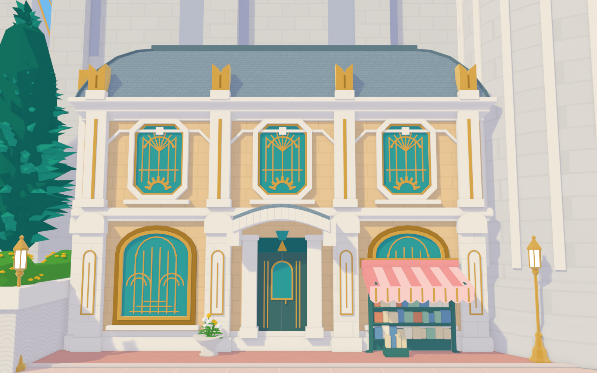
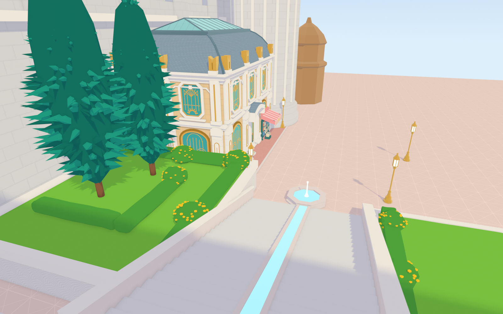
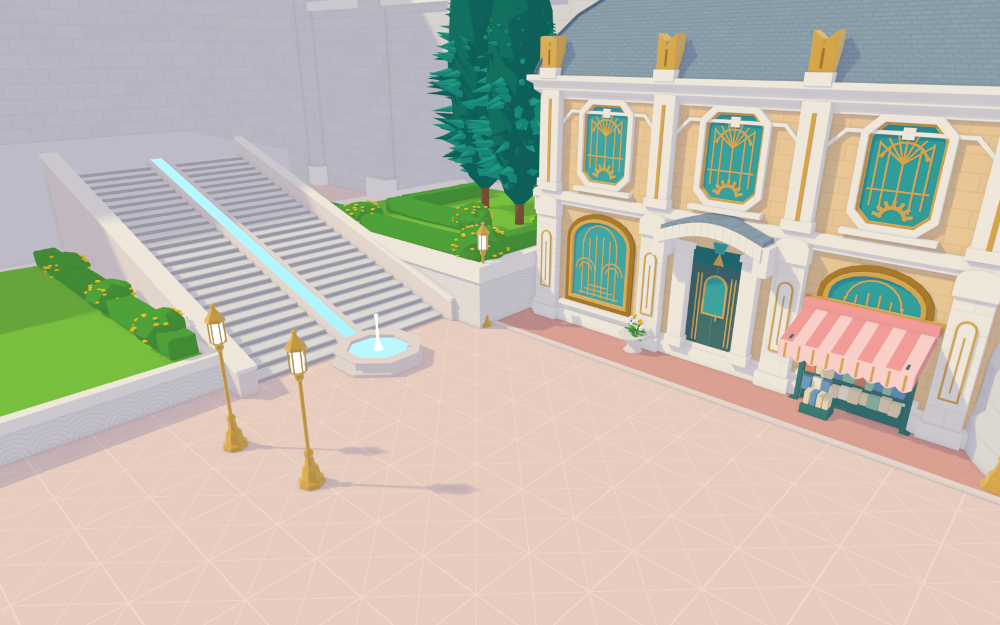

# 原神·枫丹廷 芙宁娜家门口（Blender，精细版 v1）

| 正面（参考图2） | 台阶顶俯视（参考图1） | 广场斜俯视（参考图3） |
|---|---|---|
|  |  |  |

## 文件
- `fontaine_furina.py`：生成脚本（Blender 4.2+，在 5.0 上测试通过）
- `fontaine_furina.blend`：生成好的场景，直接打开，小键盘 0 进相机，F12 渲染
- `preview_*.png`：三个机位的渲染

## 命令行
```bash
blender -b -P fontaine_furina.py -- --view front  --render out.png
blender -b -P fontaine_furina.py -- --view stairs --render out.png
blender -b -P fontaine_furina.py -- --view plaza  --render out.png --save scene.blend
# 只生成主楼（调细节更快）：--part building
```

## 场景结构（大纲视图 → 枫丹_芙宁娜家门口）
| 集合 | 内容 | 对应函数 |
|---|---|---|
| 主楼 | 墙体+勒脚/腰线、檐口+芒萨尔屋顶+玻璃天窗、正/左/背立面、花盆 | `build_building`、`facade`、`pilaster`、`deco_*`、`bookstall` |
| 地面 | 星形纹广场地砖、玫瑰色人行道、路缘石 | `build_ground` |
| 大台阶与喷泉 | 26 级台阶、两侧矮墙、中间流水槽、八角喷泉 | `build_stairs` |
| 高台花园 | 拱纹挡土墙、草地、修剪树篱、黄花丛、柏树、右侧花坛 | `build_garden`、`cypress`、`flower_bush` |
| 路灯 | 金色六角灯笼路灯 ×4 | `street_lamp` |
| 石塔与城墙 | 圆塔、背后城墙与扶壁、蓝色旗幡、右侧铜顶小楼 | `build_backdrop` |

主楼关键尺寸在脚本顶部的常量里（`BW`、`BD`、`Z_BELT0`、`Z_CORNICE`、`Z_ROOF`……），改一个数字整栋楼会跟着变。

## 已知的简化 / 下一步可以细化的地方
- 主楼后面、塔后面的城墙目前只是带扶壁的大墙，游戏里的具体造型需要截图参考
- 圆塔顶部、旗幡的真实形状和挂法
- 台阶顶端平台连到哪里（参考图里看不到）
- 树篱、柏树是程序化的风格化形体，要更像游戏可以换成插片树叶
- 人行道现在是砖纹，游戏里是六边形砖
