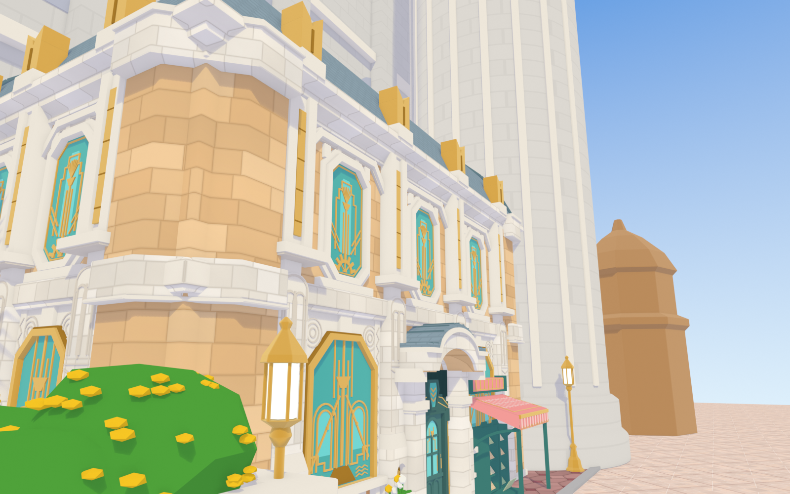
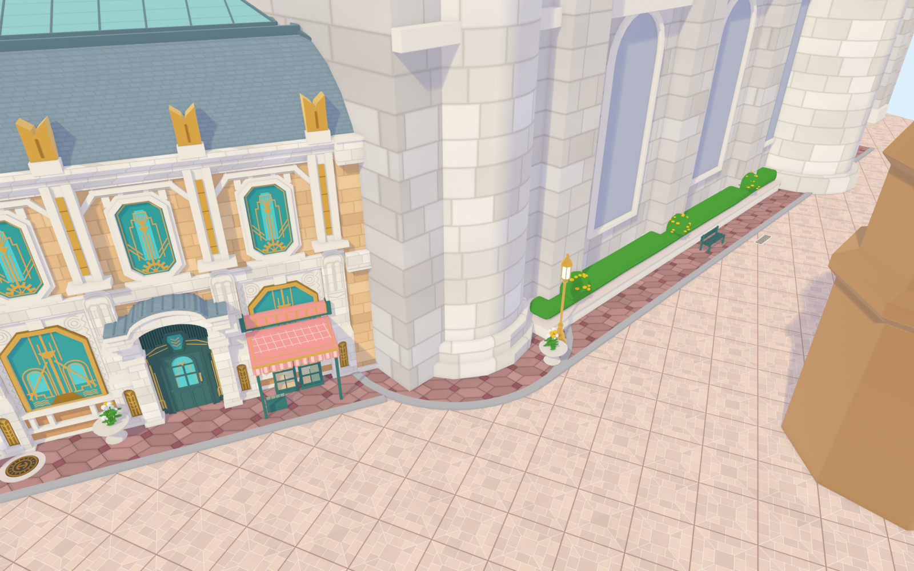
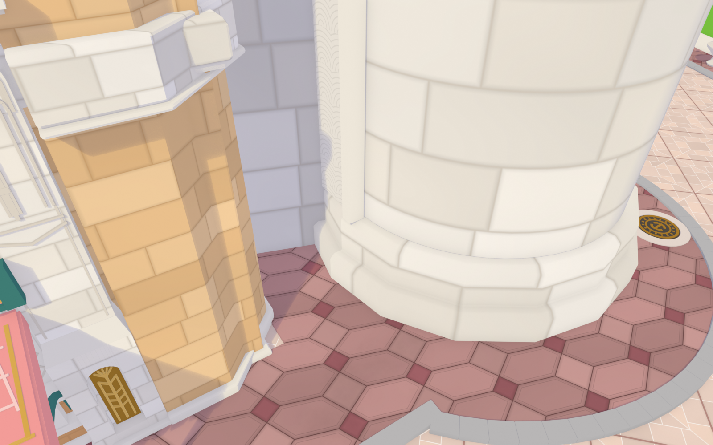
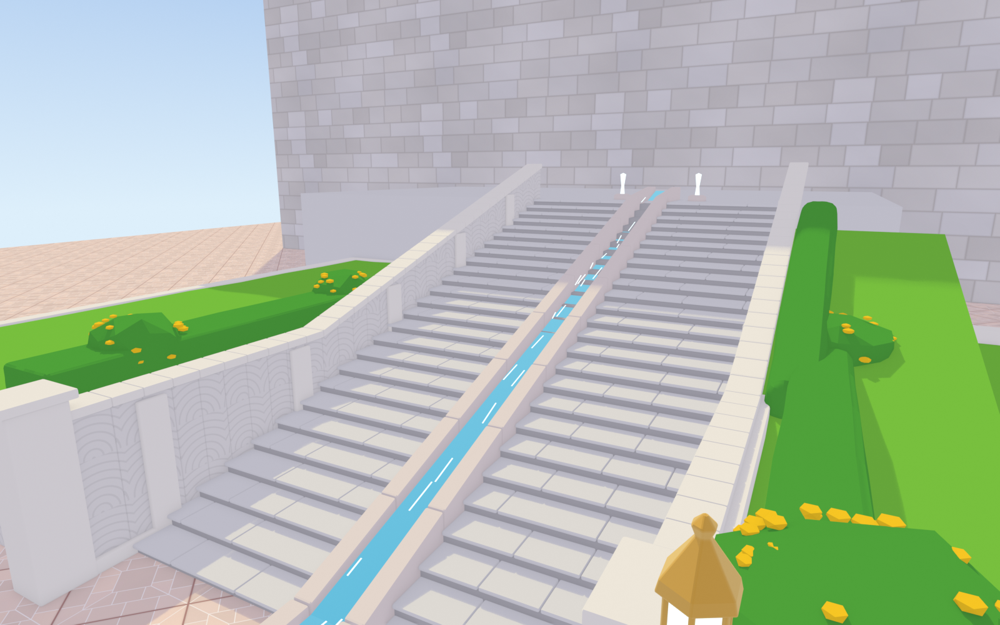
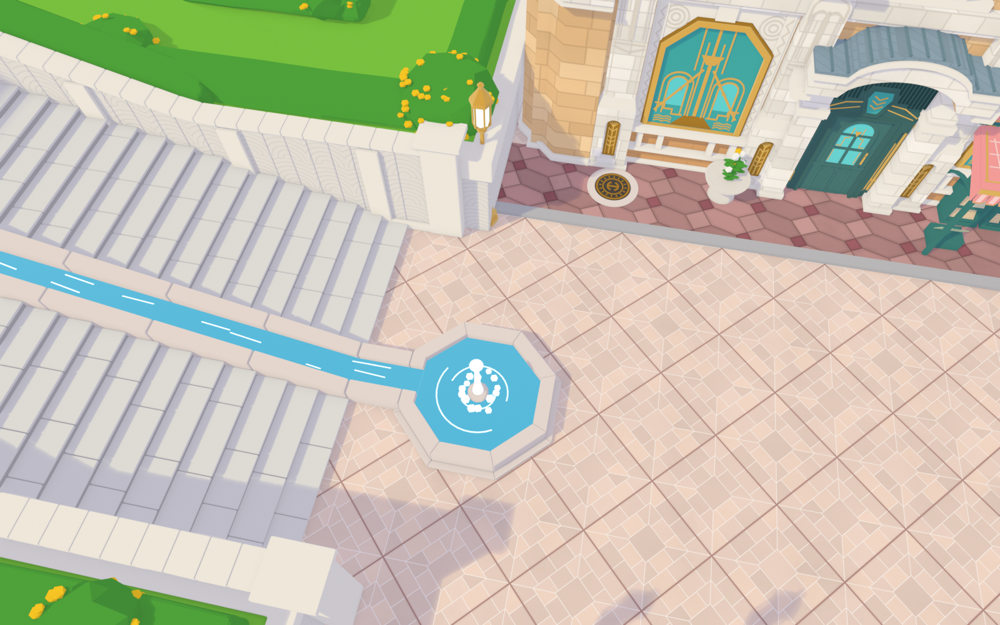
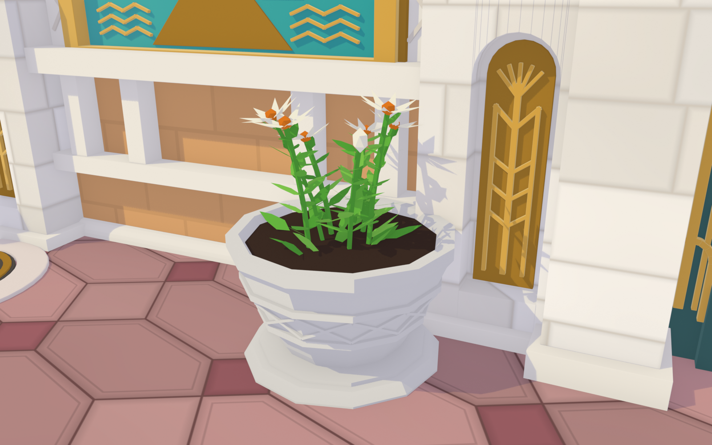
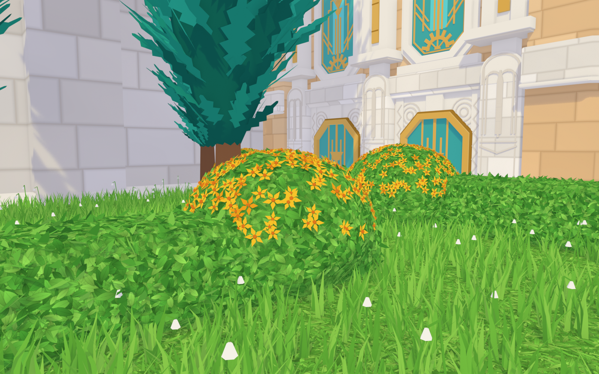

# 原神·枫丹廷 芙宁娜家门口（Blender，精细版 v1）

| 正面（参考图2） | 台阶顶俯视（参考图1） |
|---|---|
|  |  |
| **广场斜俯视（参考图3）** | **广场与地砖（参考图7）** |
|  |  |
| **门口地砖（参考图9）** | **路对面砖路与井盖（参考图8）** |
|  |  |
| **立面近景：大门与书报摊（参考图14/15）** | **立面斜看（参考图13）** |
|  |  |
| **楼角与二层（参考图17）** | **圆塔与右侧大墙（参考图20）** |
|  |  |
| **圆塔底座（参考图19）** | **仰看台阶与流水槽（参考图23）** |
|  |  |
| **八角喷泉（参考图24）** | **门口花盆（参考图25）** |
|  |  |
| **花园植物（参考图26）** | |
|  | |

## 文件
- `fontaine_furina.py`：生成脚本（Blender 4.2+，在 5.0 上测试通过）
- `fontaine_furina.blend`：生成好的场景，直接打开，小键盘 0 进相机，F12 渲染
- `preview_*.png`：各机位的渲染
- `textures/`：程序生成的地砖贴图（颜色 + 高度），已打包进 .blend，这里是另存的 PNG

## 地砖（v2 新增）
地砖是可以无缝重复的图案，所以不用建模，而是由脚本用 numpy 逐像素“画”成贴图再平铺：
- **广场“画框”砖** `gen_plaza_tiles()`：1.7 m 大方砖转 45° 铺成菱形；每块 = 中心方块 + 两圈错缝长条砖，
  四条对角斜接线；白色细缝，大砖之间是粉褐色缝。每一小块有轻微色差，高度图让缝有凹陷感。
- **玫瑰色风车砖** `gen_hex_pavers()`（v3 按近景截图重做）：四种砖——暗红小方砖（0.30 m）、浅色大方砖（0.48 m）、
  横向和竖向的“切角长方形”六边形（带内倒角线）。横竖六边形共用长斜边，大小方砖沿对角线角碰角，
  是旋转对称的风车排布；整套拼法相对楼的立面斜约 18°（`HEX_ROT`），不与楼对齐。用在主楼门口人行道和路缘石外的砖路上。
- **水渍**：材质里的低频噪声把局部压暗，砖路最重、人行道和广场很淡（`toon(..., stains=)`）。
- **井盖** `manhole()`：石圈 + 铸铁盖 + 金色同心环、放射筋、中间一对弧纹；砖路上一个，门口人行道上一个。
- 尺寸在脚本顶部：`PLAZA_TILE`（广场砖）、`HEX_G / HEX_SQ / HEX_CUT / HEX_ROT`（风车砖）。

## 命令行
```bash
blender -b -P fontaine_furina.py -- --view front  --render out.png
blender -b -P fontaine_furina.py -- --view stairs --render out.png
blender -b -P fontaine_furina.py -- --view plaza  --render out.png --save scene.blend
blender -b -P fontaine_furina.py -- --view ground --render out.png --export-textures textures
# 地砖近景：--view doorstep / --view road
# 只生成主楼（调细节更快）：--part building
# 一次渲染多个机位（贴图只生成一次，也会缓存到 ~/.cache）：--view fountain,stairs_up --render "out_{view}.png"
```

## 场景结构（大纲视图 → 枫丹_芙宁娜家门口）
| 集合 | 内容 | 对应函数 |
|---|---|---|
| 主楼 | 墙体+勒脚/腰线、檐口+芒萨尔屋顶+玻璃天窗、正/左/背立面、花盆 | `build_building`、`facade`、`pilaster`、`deco_*`、`bookstall` |
| 地面 | 星形纹广场地砖、玫瑰色人行道、路缘石 | `build_ground` |
| 大台阶与喷泉 | 26 级台阶、两侧矮墙、中间流水槽、八角喷泉 | `build_stairs` |
| 高台花园 | 拱纹挡土墙、草地、修剪树篱、黄花丛、柏树、右侧花坛 | `build_garden`、`cypress`、`flower_bush` |
| 路灯 | 金色六角灯笼路灯 ×4 | `street_lamp` |
| 石塔与城墙 | 圆塔、背后城墙与扶壁、蓝色旗幡、右侧铜顶小楼 | `build_backdrop` |

主楼关键尺寸在脚本顶部的常量里（`BW`、`BD`、`Z_BELT0`、`Z_CORNICE`、`Z_ROOF`……），改一个数字整栋楼会跟着变。

## 立面（v4 按近景截图重做）
- **一层石墩** `lower_pier()`：底座 → 宽墩身（拱形壁龛 + 金色浮雕板）→ 斜面收分 → 石块砌的窄墩身
  → V 形线与喷泉双拱浮雕 → 抹角“子弹头”墩顶（立在腰线前）
- **二层壁柱** `upper_pier()`：窗台高度的挑出横板 + 短颈；柱身凹槽里嵌宽金条；檐口上金色书本柱头
- **一层大窗** `ground_window_bay()`：白石凹板、上角同心圆浮雕、两侧折线纹石条；平顶斜角金框彩窗
  （主干 + 喷泉杯、嵌套半圆拱、A 字斜线与圆钉、阶梯纹、波浪）；窗下白石栏杆 + 橙色砂岩墙裙
- **大门** `door_portal()`：带柱头的方石柱、深青色厚门框、门楣竖向凹槽 + 阶梯轮廓 + 六边形宝石拱心石、
  单扇门（拱形彩窗 + 圆头门板 + 金把手）、两侧金色火炬形长杆、篮柄拱白石雨棚 + 带竖肋的金属弧顶
- **书报摊** `bookstall()`：带金色竖带的粉色卷筒、金边斜篷布、方形条纹垂片、青色立柱与弧撑、两个报刊架
- 近景机位：`--view facade`、`--view facade_side`、`--view corner`

## 立面 v5（按楼角 / 二层近景截图补充）
- **八角转角柱** `corner_turret()`：四个楼角都是切角的砂岩大石块体，夹在两侧立面的白石壁柱之间；
  腰线和檐口高度各绕一圈多边形厚白石板，脚下一圈勒脚
- **二层一跨** `upper_bay()`：上下切角的彩窗（内金边、阶梯轮廓、喷泉扇 + 杯、主干、张开的斜线、带辐条的半齿轮），
  白石窗套 + 顶部台阶“肩”，窗顶两根拱纹细石条，两端斜落到壁柱上的梯形眉线
- **墙面石材贴图** `gen_ashlar()`：砂岩墙、白石墩 / 腰线 / 檐口都换成程序生成的错缝石块（倒角、灰缝、轻微色差 + 凹凸）
- 立面开间按转角柱重新排布（壁柱紧贴转角柱），大门雨棚和书报摊相应收窄

## 主楼右侧（v7，参考截图 19–22）`build_tower_and_right_wall()`
- **圆塔**：半径 2.8 m，和主楼转角柱之间留 1.4 m 空隙（`TOWER_GAP`），人行道从空隙通到后面；
  大块白石错缝（圆柱贴图坐标，对象原点在塔心），脚下两层 16 棱多边形台座，顶面抹斜角；
  塔左侧（朝空隙）有白石框里的竖向拱纹石板
- **弧形人行道**：风车砖人行道绕塔脚弯出去，灰色路缘石跟着弯，止于花坛头的花盆；弧上有一个井盖
- **右侧大墙 / 街道**：从塔处往后转 72°（`WALL_ANG`，和截图对比了 50° / 66° / 75° 后选定），
  灰色巨石、扶壁、拱形凹龛、横向线脚，远处第二座圆塔
- **墙脚摆设**：长花坛（石砌 + 树篱 + 黄花丛）、花坛头路灯、青色长椅、排水篦子
- **街道对面**：弧形抬高草坪（石边 + 人行道 + 路缘石）、路灯、长椅、花盆
- 机位：`--view tower`、`--view tower_close`

## 大台阶与喷泉（v8，参考截图 23、24）`build_stairs()`
- 两段台阶夹着流水槽；每级踏面由错缝长石板拼成，鼻尖略挑出
- 流水槽：两侧分段斜石沿，水面带浅色波光；在台阶底部平走一小段后接进喷泉
- 八角喷泉：外圈低台座 + 石沿（朝台阶一边开口接水槽）+ 水池 + 中心喷头、水柱、水花和涟漪
- 两侧挡土墙：拱纹浮雕墙面、白石壁柱、随台阶升高的斜压顶、底部方墩；花园一侧的土坡和树篱随台阶升高
- 台阶另一侧花坛加高到 2 m（`SOUTH_BED_H`）；顶部平台两股小喷泉
- 机位：`--view stairs_up`、`--view fountain`

## 植物（v9，参考截图 25、26）
- **叶片 / 草地贴图** `gen_foliage()`：几千片叠放的尖叶（随机方向、叶尖亮叶根暗、叶脉、描边），六面投影包在树篱、灌木、草地上
- **树篱** `leaf_skin()`：在（带修改器的）表面按面积撒外翻叶片，轮廓毛茸茸
- **草地** `grass_skin()`：顶面撒草叶簇和垂头小白花
- **黄花丛** `flower_bush()`：叶片圆顶 + 外翻叶片 + 上半部五瓣小黄花
- **柏树** `cypress()` / `frond()`：火焰形深色树芯 + 几百片锯齿边羽状叶片，向外向上翘，越往上越亮
- **门口花盆** `flower_pot()`：十二棱石座 + 外敞盆身（两道凸环夹交叉斜纹）+ 深色土 + 对生长叶的茎和乳白尖瓣花
- 机位：`--view pot`、`--view garden`

## 已知的简化 / 下一步可以细化的地方
- 台阶顶部平台之后游戏里还有第二段台阶，目前只做到平台
- 路灯还是早期的简单金色款，游戏里是六角形带蓝玻璃的灯笼
- 主楼后面、塔后面的城墙目前只是带扶壁的大墙，游戏里的具体造型需要截图参考
- 圆塔顶部、旗幡的真实形状和挂法
- 台阶顶端平台连到哪里（参考图里看不到）
- 树篱、柏树是程序化的风格化形体，要更像游戏可以换成插片树叶
