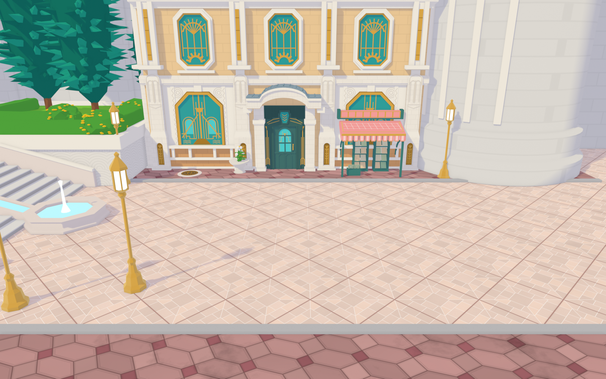
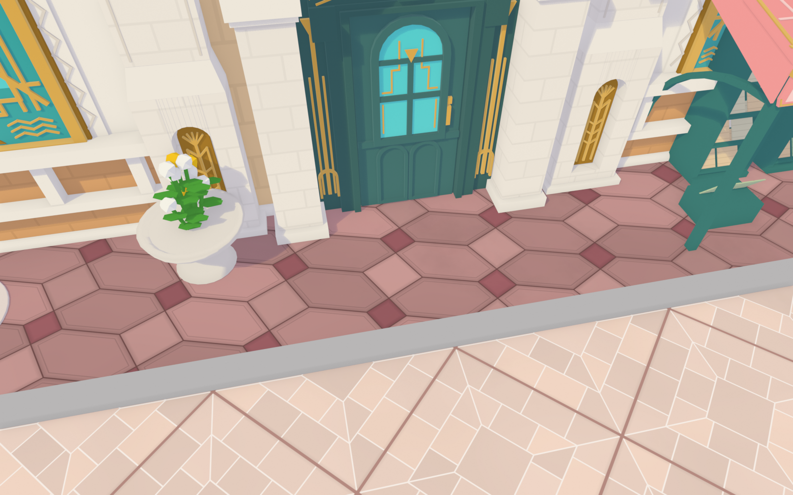
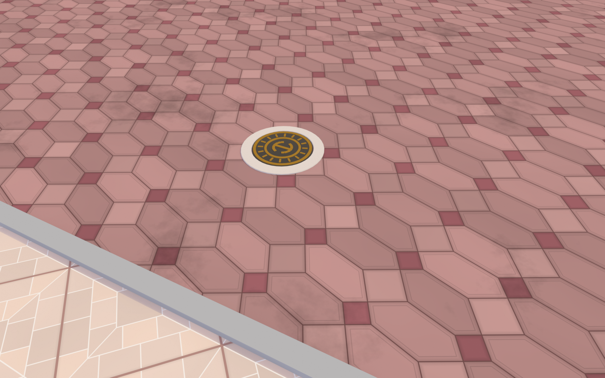
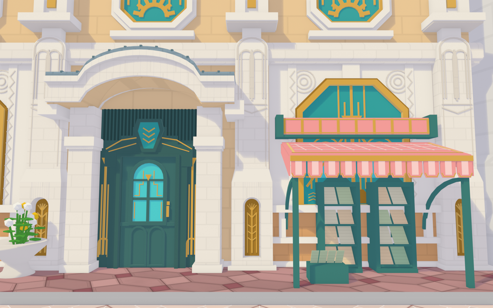
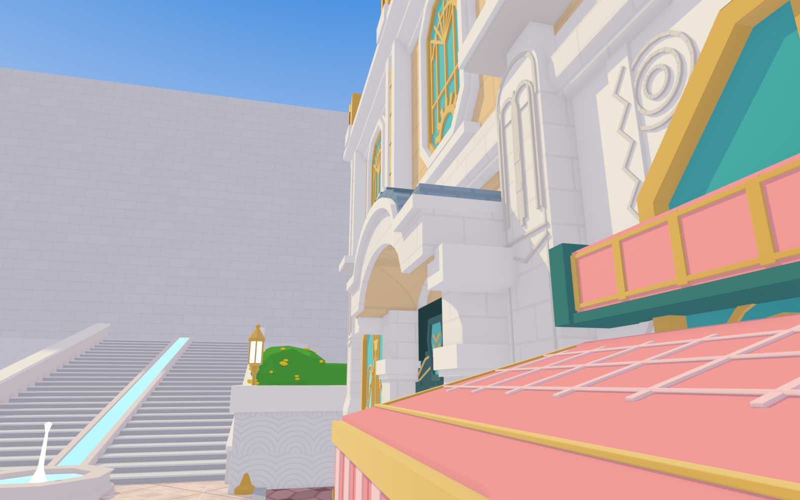

# 原神·枫丹廷 芙宁娜家门口（Blender，精细版 v1）

| 正面（参考图2） | 台阶顶俯视（参考图1） |
|---|---|
|  |  |
| **广场斜俯视（参考图3）** | **广场与地砖（参考图7）** |
|  |  |
| **门口地砖（参考图9）** | **路对面砖路与井盖（参考图8）** |
|  |  |
| **立面近景：大门与书报摊（参考图14/15）** | **立面斜看（参考图13）** |
|  |  |

## 文件
- `fontaine_furina.py`：生成脚本（Blender 4.2+，在 5.0 上测试通过）
- `fontaine_furina.blend`：生成好的场景，直接打开，小键盘 0 进相机，F12 渲染
- `preview_*.png`：八个机位的渲染
- `textures/`：程序生成的地砖贴图（颜色 + 高度），已打包进 .blend，这里是另存的 PNG

## 地砖（v2 新增）
地砖是可以无缝重复的图案，所以不用建模，而是由脚本用 numpy 逐像素“画”成贴图再平铺：
- **广场“画框”砖** `gen_plaza_tiles()`：1.7 m 大方砖转 45° 铺成菱形；每块 = 中心方块 + 两圈错缝长条砖，
  四条对角斜接线；白色细缝，大砖之间是粉褐色缝。每一小块有轻微色差，高度图让缝有凹陷感。
- **玫瑰色风车砖** `gen_hex_pavers()`（v3 按近景截图重做）：四种砖——暗红小方砖（0.30 m）、浅色大方砖（0.48 m）、
  横向和竖向的“切角长方形”六边形（带内倒角线）。横竖六边形共用长斜边，大小方砖沿对角线角碰角，
  是旋转对称的风车排布；整套拼法相对楼的立面斜约 18°（`HEX_ROT`），不与楼对齐。用在主楼门口人行道和路缘石外的砖路上。
- **水渍**：材质里的低频噪声把局部压暗，砖路最重、人行道和广场很淡（`toon(..., stains=)`）。
- **井盖** `manhole()`：石圈 + 铸铁盖 + 金色同心环、放射筋、中间一对弧纹；砖路上一个，门口人行道上一个。
- 尺寸在脚本顶部：`PLAZA_TILE`（广场砖）、`HEX_G / HEX_SQ / HEX_CUT / HEX_ROT`（风车砖）。

## 命令行
```bash
blender -b -P fontaine_furina.py -- --view front  --render out.png
blender -b -P fontaine_furina.py -- --view stairs --render out.png
blender -b -P fontaine_furina.py -- --view plaza  --render out.png --save scene.blend
blender -b -P fontaine_furina.py -- --view ground --render out.png --export-textures textures
# 地砖近景：--view doorstep / --view road
# 只生成主楼（调细节更快）：--part building
```

## 场景结构（大纲视图 → 枫丹_芙宁娜家门口）
| 集合 | 内容 | 对应函数 |
|---|---|---|
| 主楼 | 墙体+勒脚/腰线、檐口+芒萨尔屋顶+玻璃天窗、正/左/背立面、花盆 | `build_building`、`facade`、`pilaster`、`deco_*`、`bookstall` |
| 地面 | 星形纹广场地砖、玫瑰色人行道、路缘石 | `build_ground` |
| 大台阶与喷泉 | 26 级台阶、两侧矮墙、中间流水槽、八角喷泉 | `build_stairs` |
| 高台花园 | 拱纹挡土墙、草地、修剪树篱、黄花丛、柏树、右侧花坛 | `build_garden`、`cypress`、`flower_bush` |
| 路灯 | 金色六角灯笼路灯 ×4 | `street_lamp` |
| 石塔与城墙 | 圆塔、背后城墙与扶壁、蓝色旗幡、右侧铜顶小楼 | `build_backdrop` |

主楼关键尺寸在脚本顶部的常量里（`BW`、`BD`、`Z_BELT0`、`Z_CORNICE`、`Z_ROOF`……），改一个数字整栋楼会跟着变。

## 立面（v4 按近景截图重做）
- **一层石墩** `lower_pier()`：底座 → 宽墩身（拱形壁龛 + 金色浮雕板）→ 斜面收分 → 石块砌的窄墩身
  → V 形线与喷泉双拱浮雕 → 抹角“子弹头”墩顶（立在腰线前）
- **二层壁柱** `upper_pier()`：窗台高度的挑出横板 + 短颈；柱身凹槽里嵌宽金条；檐口上金色书本柱头
- **一层大窗** `ground_window_bay()`：白石凹板、上角同心圆浮雕、两侧折线纹石条；平顶斜角金框彩窗
  （主干 + 喷泉杯、嵌套半圆拱、A 字斜线与圆钉、阶梯纹、波浪）；窗下白石栏杆 + 橙色砂岩墙裙
- **大门** `door_portal()`：带柱头的方石柱、深青色厚门框、门楣竖向凹槽 + 阶梯轮廓 + 六边形宝石拱心石、
  单扇门（拱形彩窗 + 圆头门板 + 金把手）、两侧金色火炬形长杆、篮柄拱白石雨棚 + 带竖肋的金属弧顶
- **书报摊** `bookstall()`：带金色竖带的粉色卷筒、金边斜篷布、方形条纹垂片、青色立柱与弧撑、两个报刊架
- 近景机位：`--view facade`、`--view facade_side`

## 已知的简化 / 下一步可以细化的地方
- 二层彩窗的花纹还是 v1 的简化版（扇形 + 齿轮），近景截图里是主干 + 阶梯轮廓 + 底部斜线
- 主楼后面、塔后面的城墙目前只是带扶壁的大墙，游戏里的具体造型需要截图参考
- 圆塔顶部、旗幡的真实形状和挂法
- 台阶顶端平台连到哪里（参考图里看不到）
- 树篱、柏树是程序化的风格化形体，要更像游戏可以换成插片树叶
