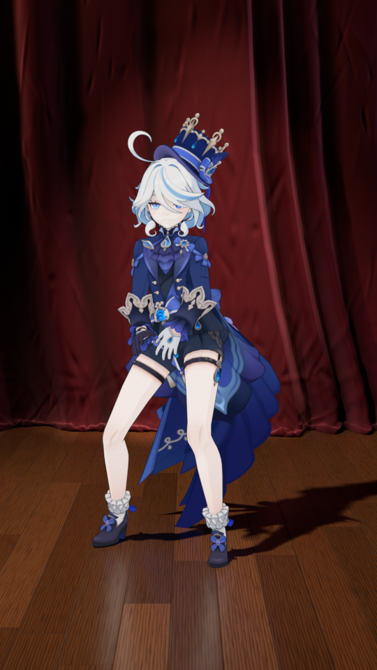

# 芙宁娜 MMD · 舞台背景（酒红丝绒幕布 + 木地板）

| 第 1 帧 | 第 200 帧 | 第 400 帧 | 第 600 帧 |
|---|---|---|---|
|  |  |  |  |

| 原分辨率细节（第 300 帧） | 舞台全景（`舞台全景相机`） |
|---|---|
|  |  |

## 文件
- `add_stage.py`：在已有的芙宁娜场景（`Furina_Mesh` / `Furina_Rig` / `Cel Key` …）里生成舞台。可以重复运行，每次会先删掉上一次生成的再重建。
- `preview_*.png`：用原来的动画相机渲染的预览（EEVEE，50% 分辨率）+ 一张原分辨率 + 一张全景。
- 带人物的 `.blend` 不放进仓库（仓库是公开的，模型不便二次分发），单独发。

## 用法（Blender 5.2）
```bash
# 生成并另存
blender -b 模型.blend -P add_stage.py -- --save furina_stage.blend
# 顺便渲几帧预览
blender -b 模型.blend -P add_stage.py -- --render "out/frame_{frame}.png" --frames 1,200,400 --percent 50
# 全景机位
blender -b 模型.blend -P add_stage.py -- --render out/overview.png --overview
```
在界面里：打开模型文件 → “脚本”工作区 → 打开 `add_stage.py` → 运行。

## 舞台里有什么（大纲视图 → 舞台背景）
| 集合 | 内容 |
|---|---|
| 幕布 | 背景大幕（13 m × 7.5 m，台面上有一小截堆褶）、左右边幕、顶部檐幕（5 个垂花弧 + 金绳 + 流苏） |
| 地板 | 长条木地板、台口圆鼻条、黑漆台唇和一道金线 |
| 舞台灯光 | 主追光、背幕光池、左右侧掠光、顶排光、檐幕光、`舞台全景相机` |
| 薄雾 | 很淡的舞台烟雾（默认不渲染，想要光束感就在大纲里打开它的渲染） |

相机里能看到的主要是大幕的下半段和人物脚前约 3 m 的地板（42 mm 竖屏，视角窄），
边幕和檐幕只在全景机位里出现，换别的机位时舞台也是完整的。

## 质感怎么做的（全部程序化，不依赖贴图）
- **丝绒** `mat_velvet()`：正对视线时是深酒红，掠射角泛出偏玫红的绒光（层权重 + Sheen）；
  竖向绒毛条纹、大块“倒毛”明暗、细密织物凹凸。褶子的几何 `pleat_field()`：周期和深度沿幅宽随机变化，
  两个谐波叠加（前圆后尖），越往下越散开；底部用 softplus 圆滑地拐到台面上堆一截。
- **木地板** `mat_wood_floor()`：15 cm × 2.1 m 的长条，逐条随机错缝；每块板有自己的明度和冷暖、
  木纹随机平移；生长轮 + 细直纹 + 棕眼；板缝凹进、板边小倒角、每块板轻微不平（倒影会一块块断开）；
  半哑光清漆层，带大块擦拭痕迹的粗糙度变化。开启了 EEVEE 光线追踪，地板上有幕布和人物的倒影。
- **灯光**：主追光和人物 `Cel Key` 同方向，所以地上的影子和她身上的明暗一致；
  背幕光池在她身后打一团暖光，四周自然暗下去，把人和背景拉开；左右侧掠光贴着幕布打，突出褶子。

## 对原人物的改动（保证她的观感不变）
人物材质是 漫射 → Shader 转 RGB → 三阶色，任何灯光、环境光都会改变她的明暗。所以：
- 舞台灯通过灯光链接只照舞台（`舞台_受光`）；原来的 `Cel Key`、`Cel Face Fill` 只照人物（`角色_受光`），
  并且不参与体积雾（`volume_factor = 0`）。
- 世界换成很暗的 `舞台环境`；原世界 `Neutral studio background` 保留（假用户），
  它提供的均匀环境光在人物材质的“Shader 转 RGB”之后用一个 `舞台_原环境光补偿` 相加节点补回。
  对比渲染：人物像素和原文件几乎完全一致（平均差 < 0.01/255）。
- 原来的 `Studio_Ground` 只是隐藏了，没删。

想恢复原样：把世界换回 `Neutral studio background`，删掉 `舞台_原环境光补偿` 节点（或把它的 B 颜色改成黑），
清掉两盏人物灯的灯光链接，显示 `Studio_Ground`，删掉 `舞台背景` 集合。

## 可调参数（脚本顶部）
`CURTAIN_Y`（大幕离人物多远）、`CURTAIN_W / CURTAIN_H`、`PROSC_HALF`（台口半宽）、
`PLANK_W / PLANK_L`（地板条尺寸）。颜色在 `mat_velvet()` 的 `core / rim`、`mat_wood_floor()` 的色带里。
灯的强弱在 `build_lights()`。
