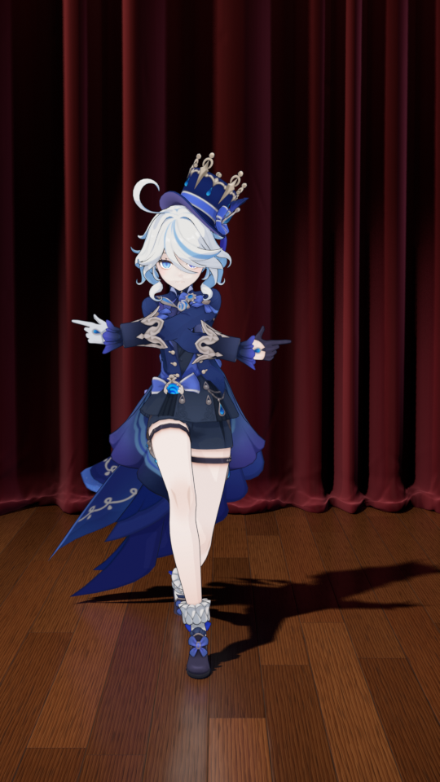
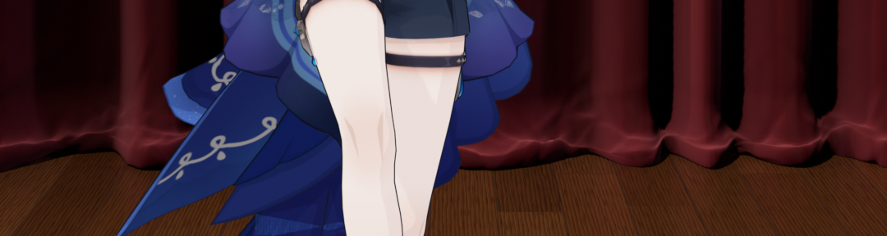

# 芙宁娜 MMD · 舞台背景（酒红丝绒幕布 + 木地板）



## 文件
- `add_stage.py`：在已有的芙宁娜场景（`Furina_Mesh` / `Furina_Rig` / `Cel Key` …）里生成舞台。可以重复运行，每次会先删掉上一次生成的再重建。
- `preview_frame_0200.png`：用原来的动画相机渲染的第 200 帧（EEVEE，50% 分辨率）；`preview_hem_0200.png`：同一帧底边堆布的原分辨率局部。
- 带人物的 `.blend` 不放进仓库（仓库是公开的，模型不便二次分发），单独发。

## 用法（Blender 5.2）
```bash
# 生成并另存
blender -b 模型.blend -P add_stage.py -- --save furina_stage.blend
# 顺便渲几帧预览
blender -b 模型.blend -P add_stage.py -- --render "out/frame_{frame}.png" --frames 1,200,400 --percent 50
# 全景机位
blender -b 模型.blend -P add_stage.py -- --render out/overview.png --overview
```
在界面里：打开模型文件 → “脚本”工作区 → 打开 `add_stage.py` → 运行。

## 舞台里有什么（大纲视图 → 舞台背景）
| 集合 | 内容 |
|---|---|
| 幕布 | 背景大幕（13 m × 7.5 m，台面上有一小截堆褶）、左右边幕、顶部檐幕（5 个垂花弧 + 金绳 + 流苏） |
| 地板 | 长条木地板、台口圆鼻条、黑漆台唇和一道金线 |
| 舞台灯光 | 主追光、背幕光池、左右侧掠光、顶排光、檐幕光、`舞台全景相机` |
| 薄雾 | 很淡的舞台烟雾（默认不渲染，想要光束感就在大纲里打开它的渲染） |

相机里能看到的主要是大幕的下半段和人物脚前约 3 m 的地板（42 mm 竖屏，视角窄），
边幕和檐幕只在全景机位里出现，换别的机位时舞台也是完整的。

## 质感怎么做的（全部程序化，不依赖贴图）
- **幕布褶子** `fold_field()`：保留厚丝绒的垂坠感——褶窄而深（褶脊到褶谷平均 12 cm、深约 11 cm），从上到下笔直；
  不规律只放在横向：褶一个一个随机“走”出来，宽窄按对数正态随机、每个褶脊 / 褶谷深度各不相同，
  每隔约 3 m 有一处温和的堆叠区（褶更挤更深）；截面前圆后尖、每段随机歪斜；顶部挂杆处渐渐被拉整齐。
  这些都在脚本顶部的 `CURTAIN_DRAPE` 里调（`drift` / `wobble` 调大，褶就会沿高度漂移、变深变浅，布显得更软）。
- **细小皱纹** `add_creases()`：大幕上只有约 230 条很浅的近竖直折痕（不破坏垂坠），底边堆布上约 450 条短皱。
- **底边堆布**：多出来的布“堆”在台面上——竖直垂下 → 向前弯出一个鼓包 → 在最前面绕一个圆弧折回 → 剩下的布平铺在鼓包下面往后藏。台前看到的是圆润厚实的折边（向前约 10–20 cm、高约 10–25 cm，沿宽度处处不同，上面还有揉皱的起伏和短皱），看不到布的末端。尺寸在脚本顶部的 `HEM_POOL` 里调。

  
- **丝绒** `mat_velvet()`：正对视线时是深酒红，掠射角泛出偏玫红的绒光（层权重 + Sheen）；
  褶谷用几何里存的 `fold` 属性压暗；竖向绒毛条纹、大块深浅不一的“倒毛”明暗、小块“压绒”、细密织物凹凸。
- **木地板** `mat_wood_floor()`：一个平面 + 程序材质。15 cm × 2.1 m 的长条，逐列随机错缝。
  所有板用同一个木纹公式（锯齿波年轮 + 细直纹 + 棕眼 + 低频色斑），但每块板用自己的随机数
  把公式的输入参数**轻微**抖动——年轮疏密 ±8%（基准 34）、年轮扭曲 ±12%（5.0）、沿板长拉伸 ±10%（0.05）、
  细纹疏密 ±6%（95）、年轮深浅 ±10%（0.38），幅度在脚本顶部的 `WOOD_JITTER` 里调；
  再加上随机的纹理偏移和一点明度 / 冷暖差，所以块块相似又块块不同。
  板缝、板边小倒角、每块板轻微不平（倒影会一块块断开）、半哑光清漆上的擦拭痕迹；
  开启了 EEVEE 光线追踪，地板上有幕布和人物的倒影。
- **灯光**：主追光和人物 `Cel Key` 同方向，所以地上的影子和她身上的明暗一致；
  背幕光池从正前上方在她身后打一团暖光（只照大幕和地板，`背幕_受光`，避免在檐幕上打出热斑），四周自然暗下去，把人和背景拉开；左右侧掠光贴着幕布打，突出褶子和折痕；
  檐幕光和左右边幕光通过灯光链接只照檐幕和边幕（`檐幕边幕_受光`），全景机位里能看出台口轮廓。

## 对原人物的改动（保证她的观感不变）
人物材质是 漫射 → Shader 转 RGB → 三阶色，任何灯光、环境光都会改变她的明暗。所以：
- 舞台灯通过灯光链接只照舞台（`舞台_受光`）；原来的 `Cel Key`、`Cel Face Fill` 只照人物（`角色_受光`），
  并且不参与体积雾（`volume_factor = 0`）。
- 世界换成很暗的 `舞台环境`；原世界 `Neutral studio background` 保留（假用户），
  它提供的均匀环境光在人物材质的“Shader 转 RGB”之后用一个 `舞台_原环境光补偿` 相加节点补回。
  对比渲染：人物像素和原文件几乎完全一致（平均差 < 0.01/255）。
- 原来的 `Studio_Ground` 只是隐藏了，没删。

想恢复原样：把世界换回 `Neutral studio background`，删掉 `舞台_原环境光补偿` 节点（或把它的 B 颜色改成黑），
清掉两盏人物灯的灯光链接，显示 `Studio_Ground`，删掉 `舞台背景` 集合。

## 可调参数（脚本顶部）
`CURTAIN_Y`（大幕离人物多远）、`CURTAIN_W / CURTAIN_H`、`PROSC_HALF`（台口半宽）、
`PLANK_W / PLANK_L`（地板条尺寸）、`WOOD_JITTER`（每块板木纹参数的浮动幅度）。褶子的疏密 / 深浅：`hanging_curtain(..., mean_w=, depth=)`，
折痕数量 `n_creases`；换个随机种子（`build()` 里的 `default_rng(...)`）就是另一种褶法。
颜色在 `mat_velvet()` 的 `core / rim`、`mat_wood_floor()` 的色带里，灯的强弱在 `build_lights()`。
