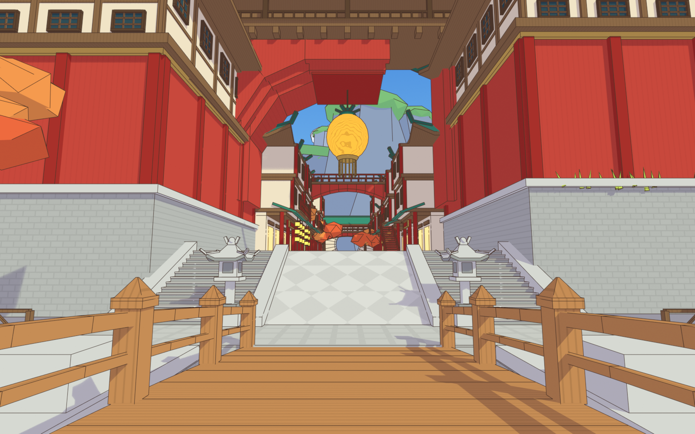
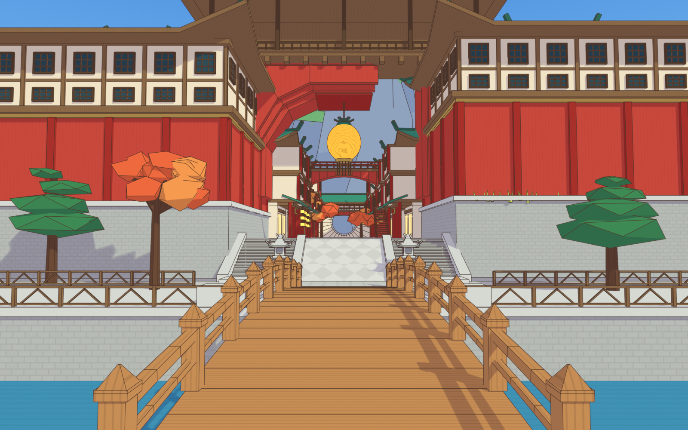

# 原神·璃月港街道场景（Blender）

用 Python 脚本在 Blender 里程序化生成的璃月街道：木拱桥 → 石阶与石灯笼 → 朱红楼阁 → 大红拱楼与云纹灯笼 → 街道商铺、红色天桥、月洞门 → 远处的石林山峰与云。
使用卡通着色（EEVEE 的 Shader to RGB 两段色阶）+ Freestyle 描边，接近游戏画风。

| 桥上仰视（参考图 1） | 桥头平视（参考图 2） |
|---|---|
|  |  |

## 文件

- `liyue_street.py`：生成脚本，所有建筑、材质、灯光、相机都在里面，可以改参数重新生成
- `liyue_street.blend`：已经生成好的场景文件（Blender 5.0 保存），直接打开即可
- `preview_*.png`：渲染预览

## 使用方法

**直接打开**：双击 `liyue_street.blend`，切到相机视角（小键盘 0），F12 渲染。

**在 Blender 里重新生成**：Scripting 工作区 → 打开 `liyue_street.py` → 运行脚本（会清空当前场景）。

**命令行渲染**：
```bash
blender -b -P liyue_street.py -- --render out.png --save scene.blend --outline
# 其他参数：--view bridge|top  --engine eevee|cycles  --res 1920x1080  --samples 64
```

## 场景结构（大纲视图里的集合）

| 集合 | 内容 |
|---|---|
| 地面与河道 | 河面、桥头广场、河岸砖墙、石堤、几何纹木栏 |
| 木桥 | 拱形木桥、望柱、扶手、桥墩 |
| 台阶与石灯 | 两侧台阶、中间斜格石板坡道、石灯笼 |
| 近景楼阁 | 左右两座大楼（灰石台基 + 朱红墙 + 米白窗层 + 绿琉璃顶） |
| 红色拱楼 | 三层退台的八角拱洞、拱上木楼、云纹大灯笼 |
| 街道商铺 | 两侧沿街商铺、外挂红梯、小黄灯笼串 |
| 天桥与月洞门 | 中段天桥、远处红桥、月洞门 |
| 自然景观 | 枫树、松树、远山石林 |
| 天空 | 云朵（天空渐变在 World 里） |

所有尺寸单位为米，人物（MMD 模型）约 1.6 m 高，站在桥面上刚好合适。

## 说明 / 可继续改进

- 这是“白模 + 风格化材质”级别的场景，适合做 MMD 背景或构图参考；要更接近游戏，可把单个对象替换成更精细的模型或贴图。
- 卡通着色只在 **EEVEE** 下生效；Cycles 下会退化为普通 PBR 材质。
- 调色板集中在脚本里的 `Mats` 类，改颜色只需要改那里的十六进制色值。
